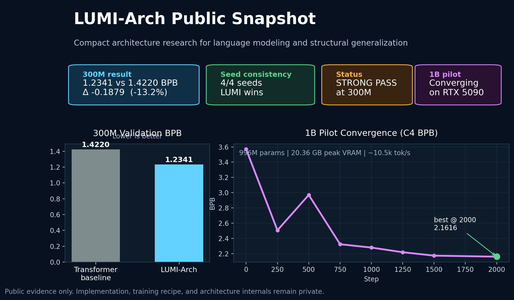

# LUMI-Arch Research Notes

**Independent AI architecture research** focused on compact language models with strong structural bias.

---

## At a glance

LUMI-Arch is an independent research program exploring whether a compact, compression-first sequence architecture can outperform a parameter-matched Transformer baseline through architectural bias rather than scale alone.

The public record is intentionally limited to:

- evaluation evidence
- benchmark interpretation
- research direction

It does **not** expose implementation details, training recipes, or enough architectural information to reproduce the system.

---

## Current public evidence

### 300M language modeling

On a parameter-matched natural-language comparison, LUMI-Arch achieved:

- **1.2341 val BPB**
- vs **1.4220** for the Transformer baseline
- **delta = -0.1879 BPB**
- **4/4 seeds confirmed**
- verdict: **STRONG PASS**

This is the strongest public result so far.

### 1B pilot convergence

A 996M-parameter pilot run completed successfully and reached:

- **2.1616 C4 BPB at step 2,000**
- **~10.5k tok/s**
- **20.36 GB peak VRAM**
- on a single **RTX 5090**

This does **not** prove scale victory yet, but it does show that the recipe converges and that 1B-scale training is practical outside hyperscale infrastructure.

### Structured generalization

Earlier experiments on symbolic and compositional tasks showed repeated wins on:

- `mod_arith`
- `bracket_structural_holdout`
- `dsl_distributive`

Those results motivated the scale-up program.

---

## Why this matters

The central question behind LUMI-Arch is simple:

> Can the right structural inductive bias let a smaller model do meaningfully more with less?

The project takes the working view that language modeling quality is not only a matter of parameter count, but also of how strongly the architecture biases the model toward useful compression and hierarchical structure.

The 300M result suggests that this hypothesis is at least viable in natural language modeling, not only in synthetic or symbolic tasks.

---

## Public materials

| Path | Description |
|---|---|
| [public_results_snapshot.md](./public_results_snapshot.md) | One-page public summary for compute / partner outreach |
| [sanity_check_note_public.md](./sanity_check_note_public.md) | Early small-scale natural-language sanity check |
| [results/300m_scale_comparison.md](./results/300m_scale_comparison.md) | 300M parameter-matched comparison |
| [results/1b_pilot_convergence.md](./results/1b_pilot_convergence.md) | 1B pilot convergence note |
| [results/structured_tasks.md](./results/structured_tasks.md) | Structured-task benchmark summary |
| [data/300m_comparison.json](./data/300m_comparison.json) | Machine-readable 300M result data |
| [data/1b_pilot_results.json](./data/1b_pilot_results.json) | Machine-readable 1B pilot data |

---

## What is intentionally not public

This repository does **not** contain:

- model source code
- architecture implementation
- training loop details
- hyperparameter sweeps
- optimizer / initialization specifics
- full recipes for reproducing the reported system
- checkpoints or weights

The goal of this repository is to establish **evidence and direction**, not to open-source the full internal research workflow at this stage.

---

## Current status

- **S1 complete:** 300M scale check passed strongly
- **S2 in progress:** 1B scale-up and recipe validation
- **Next public milestone:** full 1B run and broader benchmark evidence

---

## Contact

**Project:** LUMI-Arch  
**Author:** [@Mikeore](https://github.com/Mikeore)  
**Scope:** independent research, 2025–2026

If you're interested in compute support, collaboration, or benchmarking discussion, feel free to reach out via GitHub.
